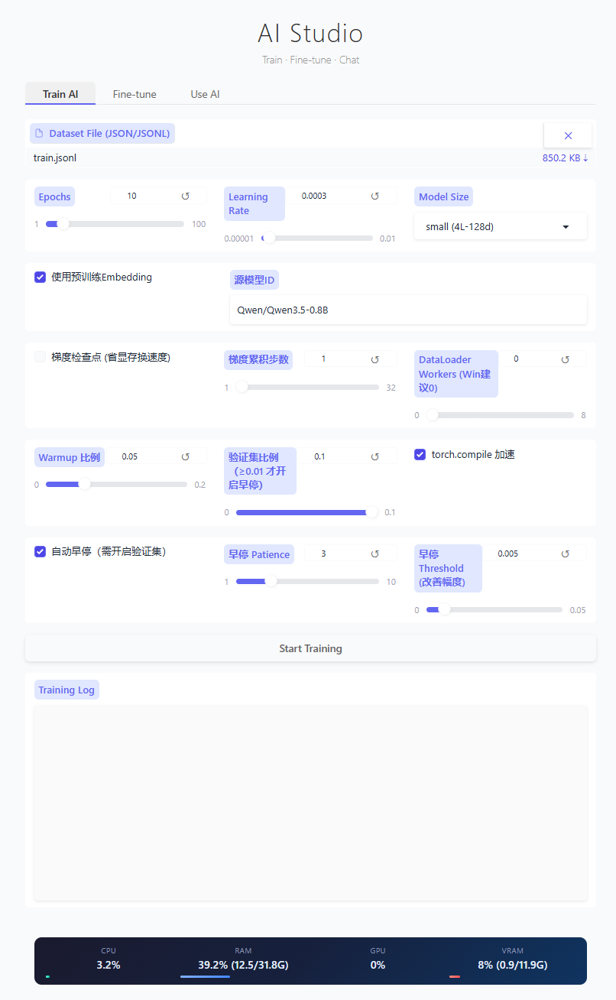
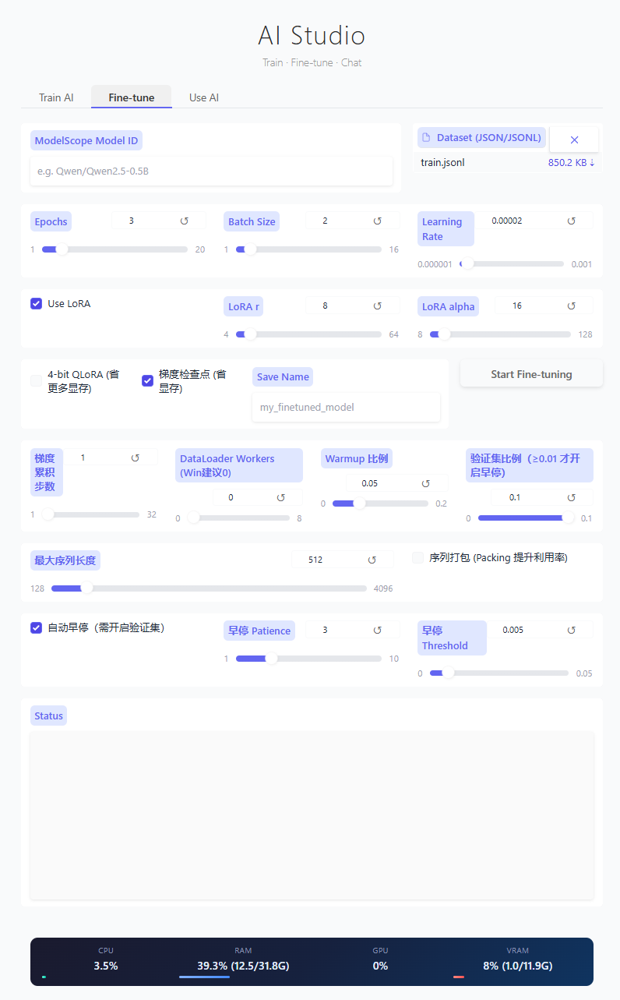
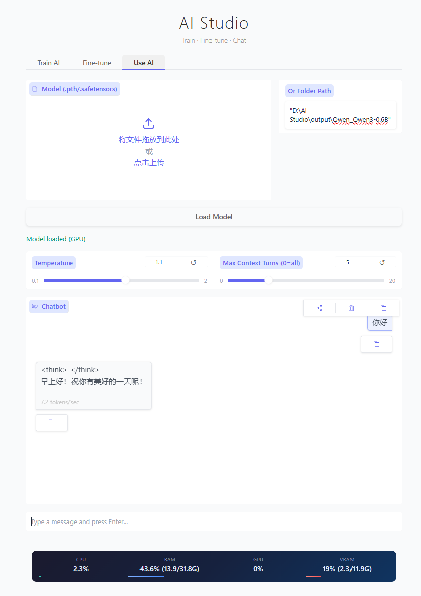
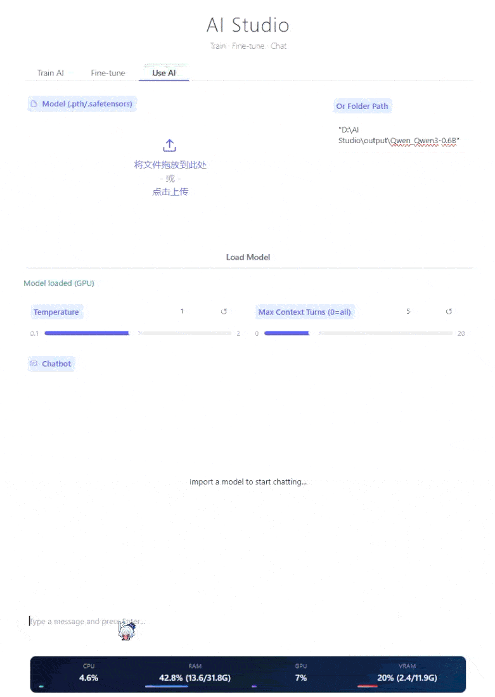

# AI Studio

<p align="center">
  <strong>Train &middot; Fine-tune &middot; Chat</strong><br>
  <sub>在本地训练、微调、对话 AI 模型的一站式工作台</sub>
</p>

<p align="center">
  
  
  
  
  
</p>

---

## 中文文档

### 功能概览

**从零训练 AI** — 上传 JSON/JSONL 对话数据集，自动识别字段格式（支持 instruction/input/output、prompt/response、question/answer 等常见键名，也支持 `system + conversation` 多轮对话格式）。基于字符级分词器 + SwiGLU GPT Transformer（全部规模默认启用），流式展示训练进度，支持自定义轮数、学习率、模型规模（small / medium / large / xlarge / max）。可从 Qwen 等大模型提取语义 embedding（通过 SVD 降维投影）作为初始知识，显著提升训练效果。大模型自动启用混合精度（AMP：bf16/fp16 自动选择）训练和自适应 batch_size，支持梯度检查点省显存。**新增：梯度累积、DataLoader 多进程、LR Warmup、验证集分割、torch.compile 加速、SDPA 原生注意力、Tokens/s 实时显示**。训练完成后保存为 `.pth` 模型文件（含模型权重、配置、分词器）。

**大模型微调** — 从 ModelScope 自动下载开源大模型，支持全量微调、LoRA 和 4-bit QLoRA 三种模式。由 HuggingFace Trainer 驱动，支持 bf16 混合精度、8-bit Adam 优化器（节省优化器状态内存）、梯度检查点，**新增：梯度累积、DataLoader 多进程、LR Warmup、验证集分割、序列打包、可配置最大序列长度、Fused AdamW（全量微调）、Flash Attention 2 / SDPA 支持**，结果保存为标准 HuggingFace 格式（可直接用于推理或进一步训练）。

**使用 AI 对话** — 支持加载自训练 `.pth` 模型、HuggingFace 文件夹格式、单文件 `.safetensors`/`.bin`/`.pth`。流式逐 token 输出，显示 tokens/sec 推理速度，具备多轮对话上下文记忆。自动检测显存/内存，不足时阻止加载并提示；多级加载策略（mmap 零拷贝 → 标准反序列化 → 兼容模式 → 原始 pickle），兼容外部训练脚本导出的模型。

**性能监控** — 实时显示 CPU / RAM / GPU / VRAM 利用率，暗色渐变状态栏，每秒自动刷新（依赖 `pynvml`/`nvidia-ml-py`）。

### 界面截图

#### 训练 AI
> 从 JSON 数据集从零训练，流式显示每轮 loss 和学习率变化




#### 微调大模型
> 从 ModelScope 下载模型，支持 LoRA / QLoRA / 全量微调



#### 对话
> 流式逐 token 输出，多轮上下文记忆，显示推理速度





#### 性能监控
> 实时 CPU / RAM / GPU / VRAM 使用率


### 快速开始

**环境要求**

| 项目 | 最低版本 | 推荐 |
|------|----------|------|
| Python | 3.10+ | 3.11+ |
| PyTorch | 2.0+ (CUDA) | 2.5+ cu130 |
| CUDA | 11.8+ | 12.4+ |
| RAM | 8 GB | 16 GB+ |
| VRAM (训练) | 4 GB | 12 GB+ |
| VRAM (微调 LoRA) | 6 GB | 16 GB+ |
| VRAM (微调全量) | 16 GB+ | 24 GB+ |

**依赖说明**  
`requirements.txt` 核心依赖：
- `torch>=2.0.0` — 深度学习框架（支持 CUDA 12.6/13.0）
- `gradio>=6.0.0` — Web UI 框架
- `transformers>=5.0.0` / `accelerate>=0.30.0` — HF 模型加载与训练
- `modelscope>=1.30.0` — ModelScope 模型下载
- `peft>=0.10.0` — LoRA/QLoRA 支持
- `bitsandbytes>=0.49.0` — 8-bit Adam + 4-bit 量化
- `datasets>=3.0.0` — 数据集处理
- `safetensors>=0.4.0` / `numpy>=1.24.0` / `tqdm>=4.66.0` / `psutil>=5.9.0`
- `pynvml` / `nvidia-ml-py` — GPU 监控（性能栏依赖）

**安装**

```bash
pip install -r requirements.txt -i https://pypi.tuna.tsinghua.edu.cn/simple
```

> **Windows 用户注意**：`bitsandbytes` 在 Windows 上需额外配置，建议使用 WSL2 或 Linux 环境进行 4-bit QLoRA 微调。仅做从零训练和 LoRA 微调时可不依赖 bitsandbytes。

**启动**

```bash
python main.py
```

或双击 `start.bat`（Windows），浏览器自动打开 `http://127.0.0.1:7860`。

**环境变量**  
- `GRADIO_SERVER_PORT` — 指定端口（默认 7860）
- `CUDA_VISIBLE_DEVICES` — 指定使用的 GPU

### 使用指南

#### 数据集格式说明

支持五种格式，自动检测：

**1. 单轮对话（键值对）** — 最常用，字段名自动识别：
```json
[
  {"instruction": "你好", "output": "你好！有什么可以帮助你的？"},
  {"prompt": "今天天气怎么样", "response": "抱歉，我无法获取实时天气信息。"}
]
```
支持的输入键：`instruction` `input` `prompt` `question` `user` `query` `text` `context` `src` `source` `human` `request`  
支持的输出键：`output` `response` `answer` `assistant` `completion` `target` `tgt` `reply` `result` `gpt` `response_text` `value`

**2. JSONL 格式** — 适合大数据集，逐行一个 JSON 对象：
```jsonl
{"input": "你好", "output": "你好！"}
{"input": "介绍一下自己", "output": "我是一个AI助手..."}
```

**3. 多轮对话格式** — 含 system prompt 和多轮 conversation：
```json
[
  {
    "system": "你是一个乐于助人的助手",
    "conversation": [
      {"human": "你好", "assistant": "你好！有什么可以帮你？"},
      {"human": "讲个笑话", "assistant": "为什么程序员分不清万圣节和圣诞节？因为 Oct 31 == Dec 25"}
    ]
  }
]
```
训练时会自动将多轮对话展开为：每轮以「system + 所有历史轮次 + 当前 human」作为输入，assistant 作为输出。

**4. OpenAI/HF 格式** — `messages` 字段：
```json
[{"messages": [{"role": "user", "content": "你好"}, {"role": "assistant", "content": "你好！"}]}]
```

**5. ShareGPT 格式** — `conversations` 字段：
```json
[{"conversations": [{"from": "human", "value": "你好"}, {"from": "gpt", "value": "你好！"}]}]
```

---

#### 从零训练 AI

1. 准备 JSON/JSONL 数据集（见上方格式）
2. 在 **Train AI** 标签页上传数据集文件
3. 调整参数：
   - **Epochs**：训练轮数（1-100）
   - **Learning Rate**：学习率（建议 1e-4 ~ 3e-4）
   - **Model Size**：模型规模
     - `small (4L-128d)` ~1M 参数，极快，适合测试
     - `medium (6L-256d)` ~10M 参数
     - `large (8L-512d)` ~40M 参数
     - `xlarge (12L-768d)` ~130M 参数
     - `max (24L-1024d)` ~1.3B 参数，需大显存
   - **使用预训练 Embedding**：从指定源模型（默认 Qwen3.5-0.8B）提取 embedding 并 SVD 降维初始化，显著加速收敛
   - **源模型 ID**：ModelScope/HF 模型 ID，如 `Qwen/Qwen2.5-0.5B`
   - **梯度检查点**：省显存换速度，大模型建议开启
   - **梯度累积步数**：有效 batch = batch_size × 累积步数（大模型建议 4-16）
   - **DataLoader Workers**：Windows 建议 0，Linux 可设 4-8
   - **Warmup 比例**：前 5-10% steps 线性预热（防 loss spike）
   - **验证集比例**：0.01-0.05，开启后每 epoch 验证并显示 Val Loss
   - **torch.compile 加速**：启用 `reduce-overhead` 模式（Windows 兼容，显著提速）
4. 点击 **Start Training**，实时查看训练日志（含配置信息、每轮 Loss、学习率、用时、Tokens/s）
5. 训练完成后显示保存面板，输入模型名称，点击 **Save** 保存到 `./output/<name>/`（含 `.pth` 权重、config、tokenizer）

**训练细节**：
- 自动混合精度（AMP）：CUDA 上自动启用 bf16（支持时）或 fp16，LayerNorm 保持 fp32
- 自适应 batch_size：max 模型自动限制为 4，xlarge 限制为 8
- 动态 block_size：自动检测数据集最长序列并调整（上限 2048）
- 优化器：AdamW (lr=3e-4, weight_decay=0.01, fused=True) + CosineAnnealingLR with Warmup
- 梯度裁剪：max_norm=1.0
- 注意力：PyTorch 2.0+ 原生 SDPA（自动选 Flash/Memory-efficient/Math 回退）

---

#### 大模型微调

1. 在 **Fine-tune** 标签页输入 ModelScope 模型 ID，例如 `Qwen/Qwen2.5-0.5B`、`ZhipuAI/GLM-4-9B-Chat`
2. 上传 JSON/JSONL 训练数据集（格式同上，自动应用模型的 chat template）
3. 选择微调模式：
   - **LoRA**（推荐，默认 r=8, alpha=16）：只训练低秩适配器，显存需求极低
   - **全量微调**：训练所有参数，需大显存（建议 24GB+）
   - **4-bit QLoRA**：勾选「4-bit QLoRA」，配合 LoRA 使用，显存最省（需 bitsandbytes）
4. 设置参数：
   - **Epochs**：通常 1-3 轮
   - **Batch Size**：LoRA 建议 2-4，全量微调建议 1-2
   - **Learning Rate**：LoRA 建议 2e-4 ~ 5e-4，全量微调 1e-5 ~ 5e-5
   - **梯度检查点**：默认开启，省显存
   - **梯度累积步数**：有效 batch = batch_size × 累积步数（大模型建议 4-16）
   - **DataLoader Workers**：Windows 建议 0，Linux 可设 4-8
   - **Warmup 比例**：前 5-10% steps 线性预热
   - **验证集比例**：0.01-0.05，开启后每 epoch 验证并保存最佳模型
   - **最大序列长度**：128-4096（默认 512，大显存可调大）
   - **序列打包**：开启后将多短样本拼接到 max_seq_length，显著提升 GPU 利用率
5. 点击 **Start Fine-tuning**，实时查看进度（含 VRAM 监控、Loss）
6. 完成后自动合并 LoRA 权重（如使用 LoRA），保存为标准 HF 格式到 `./output/<save_name>/`

**微调细节**：
- 优化器：LoRA/QLoRA 用 8-bit AdamW (`adamw_8bit`) 节省 ~60% 优化器状态内存；全量微调用 Fused AdamW (`adamw_torch_fused`) 提速
- 精度：bf16（CUDA 支持时）或 fp16
- 数据最大长度：可配置（默认 512）
- 临时训练文件自动清理
- 注意力：自动尝试启用 Flash Attention 2 / SDPA
- **自动早停**：开启验证集后，Val Loss 连续 3 次不下降（阈值 0.5%）自动停止训练，自动加载最佳模型并保存

---

#### 使用 AI 对话

1. 在 **Use AI** 标签页选择加载方式：
   - **上传模型文件**：`.pth` `.safetensors`（其余格式请使用文件夹路径加载）
   - **输入文件夹路径**：如 `D:\AI Studio\output\my_model`（推荐，含 config.json 和 tokenizer）
2. 点击 **Load Model**，等待加载完成（显示设备：GPU/CPU）
3. 调整推理参数（右侧面板）：
   - **Temperature**（0.1 ~ 2.0，默认 1.0）：
     - 0.1-0.3：确定性强，适合代码/事实问答
     - 0.7-1.0：平衡创意与连贯（默认 1.0）
     - 1.2-2.0：高随机性，适合创意写作
   - **Max Context Turns**（0 ~ 20，默认 5，仅 HF 模型生效）：
     - 0 = 全量上下文（受模型 max_len 限制）
     - 5 = 仅保留最近 5 轮对话（自动保留 system prompt）
     - 自定义 GPT 模型（.pth）不受影响，保持原有上下文逻辑
4. 在对话框输入消息，模型流式输出回复，底部显示 tokens/sec
5. 加载新模型时自动清空历史上下文并释放显存

**加载策略（自动尝试，按优先级）**：
1. **mmap + weights_only=True** — 零拷贝，内存占用最小，适合纯权重文件
2. **标准 torch.load (weights_only=False)** — 完整反序列化，含 optimizer state 时需大内存
3. **兼容模式** — 处理外部训练脚本导出的未知类
4. **原始 pickle + 手动移张量** — 最后兜底

**上下文管理（HF 模型）**：
- 启用 Max Context Turns > 0 时，仅保留最近 N 轮对话（滑动窗口）
- 自动保留 system prompt（人设/指令不丢失）
- 自定义 GPT (.pth) 模型不受影响，保持原有 `<bos>user<eos><bos>assistant<eos>` 拼接逻辑

**显存不足时**：自动检测 RAM/VRAM，不足时阻止加载并给出建议（关闭其他程序、用更小模型、加内存、导出纯权重文件）。

### 项目结构

```
ai-studio/
├── main.py                    # Gradio UI 主入口（三标签页：训练/微调/对话）
├── start.bat                  # Windows 一键启动脚本
├── requirements.txt           # Python 依赖列表
├── data.json                  # 示例数据集
├── train.jsonl                # 示例 JSONL 数据集
├── src/
│   ├── __init__.py
│   ├── config.py              # ModelConfig 数据类 + 预设规模
│   ├── model.py               # GPT Transformer 架构
│   │   ├── CausalSelfAttention  # 因果多头自注意力 (下三角掩码) + SDPA 原生注意力
│   │   ├── MLP / SwiGLUMLP      # GELU / SwiGLU 前馈网络
│   │   ├── TransformerBlock     # Pre-LN 残差连接 + 梯度检查点支持
│   │   └── GPT                  # 位置编码 + Token嵌入 + N层Block + LM Head + 权重绑定
│   ├── tokenizer.py           # CharTokenizer 字符级分词器
│   │   ├── 特殊 token: <pad> <bos> <eos> <unk>
│   │   ├── save/load JSON、to_dict/from_dict
│   │   └── encode/decode (支持 add_special_tokens)
│   ├── dataset.py             # 数据集加载与处理
│   │   ├── ConversationDataset  # 对话拼接 <bos>user<eos><bos>assistant<eos>，滑动窗口
│   │   ├── detect_dataset_format  # 自动识别输入/输出键名
│   │   ├── load_json_dataset    # 支持 JSON/JSONL、dict包装列表、conversation多轮格式
│   │   ├── _parse_conversation_format  # 多轮展开为训练样本
│   │   ├── CollateFn            # 可 pickle 的动态 padding 函数（DataLoader 多进程）
│   │   └── make_collate_fn      # CollateFn 工厂函数
│   ├── trainer.py             # 从零训练核心
│   │   ├── train_model_stream   # 生成器式流式训练，yield 进度+最终模型
│   │   ├── train_model          # 同步接口兼容
│   │   └── save_model           # 保存 .pth (state_dict + config + tokenizer)
│   ├── inference.py           # 模型加载与推理
│   │   ├── load_model           # 多策略加载 + 显存检测 + 兼容外部模型
│   │   ├── inference_stream     # 自定义 GPT 流式推理 (yield 文本 + tps)
│   │   ├── inference_stream_hf  # HF 模型流式推理 (TextIteratorStreamer + 线程)
│   │   ├── _robust_torch_load   # 4级加载兜底策略
│   │   ├── _check_memory_feasibility  # 显存/内存可行性预检
│   │   └── _remap_state_keys    # 兼容 HF/GPT-2 等外部 state_dict key
│   ├── finetune.py            # 大模型微调
│   │   ├── download_model       # ModelScope snapshot_download
│   │   ├── fine_tune_stream     # 生成器式微调，yield 进度
│   │   ├── LoRA/QLoRA/全量微调  # peft + bitsandbytes
│   │   ├── 8-bit AdamW          # 优化器状态压缩
│   │   ├── Fused AdamW          # 全量微调加速
│   │   ├── Flash Attention 2/SDPA  # 显存加速
│   │   ├── 梯度累积 / DataLoader Workers / LR Warmup / 验证集 / 序列打包
│   │   └── VRAM 监控回调        # 训练期实时显存记录
│   └── extract_embeddings.py  # 预训练 Embedding 提取
│       └── extract_pretrained_embeddings  # Qwen embedding + SVD 降维
├── output/                    # 训练/微调产出
│   └── <model_name>/
│       ├── model.pth          # 自训练模型权重
│       ├── config.json        # 模型配置
│       └── *_tokenizer.json   # 分词器
├── cache/models/              # ModelScope 下载缓存
└── docs/                      # 截图与文档图片
```

### 模型架构

自定义 GPT 基于 Decoder-Only Transformer：

- **CausalSelfAttention** — 因果多头自注意力（下三角掩码），`c_attn` 合并 QKV 投影，支持 `gradient_checkpointing`
- **MLP / SwiGLUMLP** — 全规模默认启用 **SwiGLU**（`gate_proj` + `up_proj` + `down_proj`），兼容旧模型的 GELU MLP
- **TransformerBlock** — Pre-LN 归一化 + 残差连接，可选梯度检查点
- **GPT** — 学习式位置编码 (`wpe`) + Token 嵌入 (`wte`) + N 层 Block + 最终 LayerNorm + LM Head
- **权重绑定**：`wte.weight` 与 `lm_head.weight` 共享（节省参数、提升一致性）
- **初始化**：正态分布 `std=0.02`，残差投影缩放 `0.02 / sqrt(2 * n_layer)`

| 规模 | n_layer | n_head | n_embd | block_size | 约参数量 |
|------|---------|--------|--------|------------|----------|
| Small | 4 | 4 | 128 | 128 | ~1.2M |
| Medium | 6 | 8 | 256 | 256 | ~10M |
| Large | 8 | 8 | 512 | 512 | ~42M |
| XLarge | 12 | 12 | 768 | 768 | ~135M |
| MAX | 24 | 16 | 1024 | 1024 | ~1.3B |

**训练精度策略**：
- CUDA + bf16 支持 → `torch.bfloat16`（AMP，无需 GradScaler）
- CUDA 仅 fp16 → `torch.float16` + `GradScaler`（bf16 不可用时自动回退）
- CPU → `torch.float32`
- LayerNorm 始终保持 fp32 确保数值稳定

### 注意事项

- 首次微调从 ModelScope 下载模型，需要网络连接
- 加载大模型时自动检测显存/内存，不足时阻止加载并提示
- `weights_only=False` 用于加载自定义 `.pth` 文件 —— 仅在信任来源的模型文件上使用
- 训练自定义 GPT 时 block_size 自动适配数据集最长对话（上限 2048）
- **Windows 限制**：`bitsandbytes` (4-bit QLoRA、8-bit Adam) 在 Windows 原生不完全支持，建议使用 WSL2 或 Linux
- **大模型检查点体积**：含 optimizer state 的完整 checkpoint 可能需 10-15 倍文件大小的内存加载，建议导出时用 `torch.save(model.state_dict(), ...)` 仅保存权重
- **单文件 safetensors 加载限制**：上传单个 `.safetensors` 无法可靠定位原始文件夹和 tokenizer，请改用文件夹路径输入
- **预训练 Embedding 提取**：首次从 ModelScope 下载源模型（如 Qwen3.5-0.8B），需网络和临时显存/内存，提取完成自动释放
- **多轮对话训练**：conversation 格式会展开为多个训练样本，数据量会按轮次倍增
- **Gradio 6 兼容**：聊天历史使用 `{"role": "user/assistant", "content": "..."}` 字典格式
- **torch.compile**：Windows 上用 `reduce-overhead` 模式（不依赖 Triton），Linux 上可用 `max-autotune` 获得极致性能
- **SDPA 注意力**：PyTorch 2.0+ 原生，自动在 Flash Attention / Memory-efficient / Math 间回退，无需额外依赖
- **梯度累积**：配合小 batch_size 实现大有效 batch，显存不足时必用
- **验证集分割**：训练/微调均支持 `eval_ratio`，每 epoch 自动验证并保存最佳模型
- **自动早停**：从零训练和微调均支持；开启验证集后，Val Loss 连续 N 轮未改善（默认 patience=3, threshold=0.5%）自动停止训练
- **性能监控依赖**：需安装 `nvidia-ml-py` / `pynvml` 才能显示 GPU/VRAM 利用率
- **WSL2 fd 耗尽**：`ValueError: too many fds` 多为之前训练残留的子进程占用句柄。先 `pkill -9 -f python` 再启动；如仍报错，永久提升 fd 上限：`echo "ulimit -n 65535" >> ~/.bashrc` 并在 `/etc/security/limits.conf` 添加 `* soft/hard nofile 65535`

### 许可

MIT License

---

## English Documentation

### Features

**Train from Scratch** — Upload a JSON/JSONL conversation dataset; auto-detects field names (instruction/input/output, prompt/response, question/answer, etc.) and supports `system + conversation` multi-turn format. Built on a character-level tokenizer with a SwiGLU GPT Transformer (all sizes). Streaming training progress with customizable epochs, learning rate, and model size (small/medium/large/xlarge/max). Supports pretrained embedding initialization from Qwen models via SVD projection. Large models auto-enable mixed precision (AMP: bf16/fp16 auto-select) and adaptive batch size; gradient checkpointing available. Saves as `.pth` (weights + config + tokenizer).

**Fine-tune** — Auto-download open-source models from ModelScope. Supports full fine-tuning, LoRA, and 4-bit QLoRA. Powered by HuggingFace Trainer with bf16 mixed precision, 8-bit AdamW optimizer (saves ~60% optimizer state memory), gradient checkpointing. Output saved in standard HuggingFace format (merged LoRA weights if applicable).

**Chat** — Load custom `.pth`, HuggingFace folder format, or single `.safetensors`/`.bin`/`.pth` files. Streaming token-by-token output with tokens/sec display and multi-turn conversation context. Auto-detects GPU/CPU memory and prevents loading if insufficient. Multi-strategy loading (mmap → standard → robust pickle → raw pickle) for maximum compatibility with externally trained models.

**Performance Monitor** — Real-time CPU / RAM / GPU / VRAM utilization with a dark gradient status bar, auto-refresh every second.

### Screenshots

#### Train from Scratch
> Streaming training progress with per-epoch loss and learning rate


#### Fine-tune
> Download models from ModelScope with LoRA / full fine-tuning support


#### Chat
> Streaming token-by-token output with context memory and tokens/sec display


#### Monitor
> Real-time CPU / RAM / GPU / VRAM usage


### Quick Start

**Requirements**

| Item | Minimum | Recommended |
|------|---------|-------------|
| Python | 3.10+ | 3.11+ |
| PyTorch | 2.0+ (CUDA) | 2.5+ cu130 |
| CUDA | 11.8+ | 12.4+ |
| RAM | 8 GB | 16 GB+ |
| VRAM (Train) | 4 GB | 12 GB+ |
| VRAM (LoRA) | 6 GB | 16 GB+ |
| VRAM (Full FT) | 16 GB+ | 24 GB+ |

**Dependencies** (see `requirements.txt`):
- `torch>=2.0.0`, `gradio>=6.0.0`, `transformers>=5.0.0`, `accelerate>=0.30.0`
- `modelscope>=1.30.0`, `peft>=0.10.0`, `bitsandbytes>=0.49.0` (8-bit Adam + 4-bit QLoRA)
- `datasets>=3.0.0`, `safetensors>=0.4.0`, `numpy>=1.24.0`, `tqdm>=4.66.0`, `psutil>=5.9.0`
- `pynvml` / `nvidia-ml-py` — GPU monitoring (required for performance monitor)

**Install**

```bash
pip install -r requirements.txt -i https://pypi.tuna.tsinghua.edu.cn/simple
```

> **Windows Note**: `bitsandbytes` has limited native Windows support. Use WSL2 or Linux for 4-bit QLoRA. Training from scratch and LoRA fine-tuning work without it.

**Launch**

```bash
python main.py
```

Or double-click `start.bat` (Windows). Opens `http://127.0.0.1:7860` automatically.

**Environment Variables**
- `GRADIO_SERVER_PORT` — Port (default 7860)
- `CUDA_VISIBLE_DEVICES` — GPU selection

### User Guide

#### Dataset Formats

**1. Single-turn (key-value, auto-detected):**
```json
[
  {"instruction": "Hello", "output": "Hi there!"},
  {"prompt": "What is AI?", "response": "AI stands for..."}
]
```
Input keys: `instruction` `input` `prompt` `question` `user` `query` `text` `context` `src` `source` `human` `request`  
Output keys: `output` `response` `answer` `assistant` `completion` `target` `tgt` `reply` `result` `gpt` `response_text` `value`

**2. JSONL (one JSON per line):**
```jsonl
{"input": "Hello", "output": "Hi!"}
{"input": "Bye", "output": "Goodbye!"}
```

**3. Multi-turn with system prompt:**
```json
[
  {
    "system": "You are a helpful assistant",
    "conversation": [
      {"human": "Hi", "assistant": "Hello! How can I help?"},
      {"human": "Tell a joke", "assistant": "Why do programmers confuse Halloween and Christmas? Because Oct 31 == Dec 25"}
    ]
  }
]
```
Each turn expands to a training sample with full history as context.

**4. OpenAI/HF format** — `messages` field:
```json
[{"messages": [{"role": "user", "content": "Hi"}, {"role": "assistant", "content": "Hello!"}]}]
```

**5. ShareGPT format** — `conversations` field:
```json
[{"conversations": [{"from": "human", "value": "Hi"}, {"from": "gpt", "value": "Hello!"}]}]
```

---

#### Train from Scratch

1. Prepare JSON/JSONL dataset (see formats above)
2. Upload in **Train AI** tab
3. Configure:
   - **Epochs**: 1-100
   - **Learning Rate**: 1e-4 ~ 3e-4 recommended
   - **Model Size**: small (~1M) → max (~1.3B params)
   - **Pretrained Embedding**: Extract from source model (default Qwen3.5-0.8B) via SVD projection
   - **Source Model ID**: Any ModelScope/HF model ID
   - **Gradient Checkpointing**: Trade speed for VRAM (recommended for large models)
   - **Gradient Accumulation**: Effective batch = batch_size × accum_steps (large models: 4-16)
   - **DataLoader Workers**: 0 on Windows, 4-8 on Linux
   - **Warmup Ratio**: 5-10% steps linear warmup (prevents loss spike)
   - **Eval Ratio**: 0.01-0.05 for per-epoch validation
   - **torch.compile**: Enable `reduce-overhead` mode (Windows compatible, significant speedup)
4. Click **Start Training** → real-time logs (config, per-epoch loss, LR, time, Tokens/s)
5. Name model → **Save** → `./output/<name>/` (`.pth` + config + tokenizer)

**Training Details**: Auto AMP (bf16/fp16), adaptive batch_size (max→4, xlarge→8), dynamic block_size (dataset max, cap 2048), AdamW (fused=True) + CosineAnnealingLR with Warmup, grad clip 1.0, native SDPA (Flash/Memory-efficient/Math auto-select).

---

#### Fine-tune

1. Enter ModelScope ID in **Fine-tune** tab (e.g. `Qwen/Qwen2.5-0.5B`)
2. Upload JSON/JSONL dataset (auto-applies model's chat template)
3. Choose mode:
   - **LoRA** (default r=8, α=16) — low VRAM
   - **Full Fine-tune** — all params, high VRAM
   - **4-bit QLoRA** — check "4-bit QLoRA" + LoRA (needs bitsandbytes)
4. Set params:
   - **Epochs**: 1-3
   - **Batch Size**: LoRA 2-4, full 1-2
   - **Learning Rate**: LoRA 2e-4~5e-4, full 1e-5~5e-5
   - **Gradient Checkpointing**: on by default
   - **Gradient Accumulation**: effective batch = batch_size × accum_steps (large models: 4-16)
   - **DataLoader Workers**: 0 on Windows, 4-8 on Linux
   - **Warmup Ratio**: 5-10% steps linear warmup
   - **Eval Ratio**: 0.01-0.05 for per-epoch validation + best model save
   - **Max Sequence Length**: 128-4096 (default 512)
   - **Packing**: concatenate short samples to max_seq_length (major GPU utilization boost)
5. **Start Fine-tuning** → real-time VRAM + loss logs
6. Auto-merges LoRA, saves HF format to `./output/<name>/`

**Details**: LoRA/QLoRA use 8-bit AdamW (~60% optimizer memory); full FT uses Fused AdamW; bf16/fp16; configurable max_len; Flash Attention 2 / SDPA auto-enabled; temp dir auto-cleanup. **Auto early stopping**: with validation set enabled, stops after 3 consecutive evals without loss improvement (threshold 0.5%), auto-loads best model.

---

#### Chat

1. **Use AI** tab: upload model file (`.pth`/`.safetensors`) OR enter folder path (recommended, e.g. `D:\AI Studio\output\my_model`)
2. **Load Model** → waits for load (shows device: GPU/CPU)
3. Adjust inference parameters (right panel):
   - **Temperature** (0.1 ~ 2.0, default 1.0):
     - 0.1-0.3: deterministic, best for code/factual QA
     - 0.7-1.0: balanced creativity & coherence (default 1.0)
     - 1.2-2.0: high randomness, creative writing
   - **Max Context Turns** (0 ~ 20, default 5, HF models only):
     - 0 = full context (limited by model max_len)
     - 5 = keep last 5 turns (auto-preserves system prompt)
     - Custom GPT (.pth) models unaffected, keep original context logic
4. Chat → streaming reply with tokens/sec
5. New model load → auto-clears history + frees VRAM

**Loading Strategies** (auto-tried in order):
1. mmap + weights_only (zero-copy, minimal RAM)
2. Standard `torch.load` (full unpickle)
3. Robust pickle (handles unknown classes from external scripts)
4. Raw pickle + manual tensor move

**OOM Protection**: Pre-checks RAM/VRAM, blocks load if insufficient with actionable suggestions.

**Context Management (HF models)**:
- Max Context Turns > 0 → keeps last N turns (sliding window)
- Auto-preserves system prompt (persona/instructions retained)
- Custom GPT (.pth) models unaffected, keep original `<bos>user<eos><bos>assistant<eos>` concat logic

### Project Structure

```
ai-studio/
├── main.py                    # Gradio UI (3 tabs: Train / Fine-tune / Chat)
├── start.bat                  # Windows launcher
├── requirements.txt           # Python dependencies
├── data.json / train.jsonl    # Example datasets
├── src/
│   ├── __init__.py
│   ├── config.py              # ModelConfig dataclass + presets
│   ├── model.py               # GPT Transformer architecture
│   │   ├── CausalSelfAttention  # Causal multi-head attention (lower-triangular mask)
│   │   ├── MLP / SwiGLUMLP      # GELU / SwiGLU feed-forward
│   │   ├── TransformerBlock     # Pre-LN residual + gradient checkpointing
│   │   └── GPT                  # PosEnc + TokenEmb + N Blocks + LM Head + weight tying
│   ├── tokenizer.py           # CharTokenizer (char-level)
│   │   ├── Special tokens: <pad> <bos> <eos> ་
│   │   ├── save/load JSON, to_dict/from_dict
│   │   └── encode/decode (add_special_tokens)
│   ├── dataset.py             # Dataset loading & processing
│   │   ├── ConversationDataset  # <bos>user<eos><bos>assistant<eos>, sliding window
│   │   ├── detect_dataset_format  # Auto-detect input/output keys
│   │   ├── load_json_dataset    # JSON/JSONL, dict-wrapped list, conversation multi-turn
│   │   ├── _parse_conversation_format  # Multi-turn expansion
│   │   ├── CollateFn            # Picklable dynamic padding (DataLoader multiprocessing)
│   │   └── make_collate_fn      # CollateFn factory
│   ├── trainer.py             # From-scratch training core
│   │   ├── train_model_stream   # Generator-style streaming (yields progress + final model)
│   │   ├── train_model          # Sync wrapper for compatibility
│   │   └── save_model           # Save .pth (state_dict + config + tokenizer)
│   ├── inference.py           # Model loading & inference
│   │   ├── load_model           # Multi-strategy load + memory check + external model compat
│   │   ├── inference_stream     # Custom GPT streaming (yields text + tps)
│   │   ├── inference_stream_hf  # HF streaming (TextIteratorStreamer + thread)
│   │   ├── _robust_torch_load   # 4-level fallback loading strategy
│   │   ├── _check_memory_feasibility  # VRAM/RAM pre-check
│   │   └── _remap_state_keys    # HF/GPT-2 key remapping compat
│   ├── finetune.py            # LLM fine-tuning
│   │   ├── download_model       # ModelScope snapshot_download
│   │   ├── fine_tune_stream     # Generator-style fine-tuning (yields progress)
│   │   ├── LoRA / QLoRA / Full  # peft + bitsandbytes
│   │   ├── 8-bit AdamW          # Optimizer state compression
│   │   └── VRAM monitor callback  # Real-time VRAM logging during training
│   └── extract_embeddings.py  # Pretrained embedding extraction
│       └── extract_pretrained_embeddings  # Qwen emb + SVD projection
├── output/                    # Training/fine-tuning outputs
│   └── <model_name>/
│       ├── model.pth          # From-scratch model weights
│       ├── config.json        # Model config
│       └── *_tokenizer.json   # Tokenizer
├── cache/models/              # ModelScope download cache
└── docs/                      # Screenshots & images
```

### Architecture

Custom GPT built on Decoder-Only Transformer:

- **CausalSelfAttention** — Causal multi-head self-attention (lower-triangular mask), fused QKV projection, gradient checkpointing support
- **MLP / SwiGLUMLP** — **SwiGLU** enabled for all sizes (`gate_proj` + `up_proj` + `down_proj`), GELU MLP retained for backward compat
- **TransformerBlock** — Pre-LN normalization + residual connections, optional gradient checkpointing
- **GPT** — Learned positional encoding (`wpe`) + Token embedding (`wte`) + N Blocks + Final LayerNorm + LM Head
- **Weight Tying**: `wte.weight` ↔ `lm_head.weight` shared (parameter efficiency + consistency)
- **Init**: Normal `std=0.02`, residual projection scaled `0.02 / sqrt(2 * n_layer)`

| Size | n_layer | n_head | n_embd | block_size | ~Params |
|------|---------|--------|--------|------------|---------|
| Small | 4 | 4 | 128 | 128 | 1.2M |
| Medium | 6 | 8 | 256 | 256 | 10M |
| Large | 8 | 8 | 512 | 512 | 42M |
| XLarge | 12 | 12 | 768 | 768 | 135M |
| MAX | 24 | 16 | 1024 | 1024 | 1.3B |

**Precision Policy**:
- CUDA + bf16 → `torch.bfloat16` (AMP, no GradScaler)
- CUDA fp16 only → `torch.float16` + `GradScaler`
- CPU → `torch.float32`
- LayerNorm always fp32 for numerical stability

### Notes

- First fine-tune run downloads the model from ModelScope (requires internet)
- Memory auto-detection prevents loading models that exceed available RAM/VRAM
- `weights_only=False` is used for custom `.pth` files — only use with trusted sources
- Training auto-adjusts block_size to the longest conversation in the dataset (max 2048)
- **Windows Limitation**: `bitsandbytes` (4-bit QLoRA, 8-bit Adam) has limited native Windows support; use WSL2 or Linux
- **Large Checkpoint Memory**: Full checkpoints with optimizer states may need 10-15x file size RAM to load; export with `torch.save(model.state_dict(), ...)` for weights-only
- **Single-file safetensors**: Uploading a lone `.safetensors` cannot reliably locate original folder/tokenizer; use folder path input instead
- **Pretrained Embedding Extraction**: First run downloads source model (e.g., Qwen3.5-0.8B) from ModelScope, needs network + temporary VRAM/RAM; auto-released after extraction
- **Multi-turn Conversation Training**: `conversation` format expands to multiple training samples per dialogue turn
- **Gradio 6 Compat**: Chat history uses `{"role": "user/assistant", "content": "..."}` dict format
- **torch.compile**: Windows uses `reduce-overhead` (no Triton needed), Linux can use `max-autotune` for max performance
- **SDPA Attention**: PyTorch 2.0+ native, auto-fallback between Flash Attention / Memory-efficient / Math, no extra deps
- **Gradient Accumulation**: Combine with small batch_size to simulate large effective batch; essential for low VRAM
- **Validation Split**: Both training and fine-tuning support `eval_ratio` for per-epoch validation + best model save
- **Auto Early Stopping**: Both from-scratch training and fine-tuning support it. With eval set enabled, training stops if Val Loss doesn't improve for N consecutive epochs (default patience=3, threshold=0.5%)
- **Performance Monitor Deps**: Requires `nvidia-ml-py` / `pynvml` for GPU/VRAM stats
- **WSL2 fd exhaustion**: `ValueError: too many fds` usually means leaked child processes from a previous run. Run `pkill -9 -f python` before launching; permanently raise the limit with `echo "ulimit -n 65535" >> ~/.bashrc` and `* soft/hard nofile 65535` in `/etc/security/limits.conf`

### License

MIT License

---

<p align="center">
  <sub>Made with PyTorch & Gradio</sub>
</p>